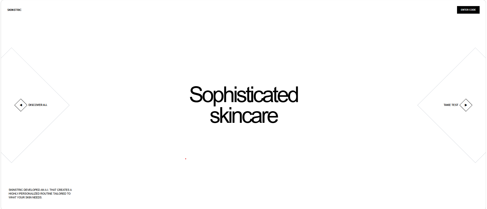

<h1 align="center">Skinstric</h1>

<p align="center">
  
  
  
  
</p>

<p align="center">
  
</p>

<p align="center">
  <strong>
    AI-powered skincare analysis experience built with Next.js, React, and TypeScript.
  </strong>
</p>

Skinstric is a multi-page AI skincare analysis experience built with Next.js, React, and TypeScript. The application guides users through entering their personal information, uploading or capturing an image, and viewing an interactive demographic analysis.

## Live Demo

[View the live application](https://skinstric-khaki.vercel.app)

## Overview

The goal of this project was to build a responsive and interactive front-end experience based on a provided design reference while implementing the complete user flow across multiple pages.

Users can:

- Enter their name and location
- Submit information through an API request
- Upload an image or use their device camera
- Preview and retake an image
- Navigate through analysis and demographic pages
- View predicted demographic results
- Move backward and forward through the full application flow
 ## My Contributions
This project was developed from a provided design reference. I implemented the frontend application and user flow, including:
- Built the multi-page experience using Next.js and React
- Implemented the application using TypeScript
- Created responsive layouts for desktop, tablet, and mobile devices
- Built name and location input validation
- Integrated the API request flow for submitting user information
- Implemented image upload and device camera functionality
- Added image preview and retake functionality
- Built loading and error states
- Used Local Storage to preserve user information
- Implemented the demographic analysis experience
- Added reusable UI patterns and navigation controls

## Features

- Multi-page application using the Next.js App Router
- Responsive layouts for desktop, tablet, and mobile devices
- Name and location input validation
- API integration for submitting user information
- Image upload functionality
- Device camera access
- Image preview and retake flow
- Loading and error states
- Local storage for preserving user information
- Interactive demographic analysis
- Animated interface elements
- Accessible navigation controls
- Reusable visual patterns across pages
- 
## Tech Stack

- Next.js
- React
- TypeScript
- HTML5
- CSS
- REST APIs
- Browser MediaDevices API
- Local Storage
- Vercel

## Application Flow

1. The user begins on the landing page.
2. The user enters their name.
3. The user enters their location.
4. The information is submitted to an API.
5. The user uploads a photo or opens the device camera.
6. The user previews or retakes the selected image.
7. The application displays the analysis experience.
8. The user views demographic prediction results.

## Routes

```text
/
├── /intro
├── /location
├── /thank-you
├── /upload
├── /loading
├── /analysis
└── /demographics
